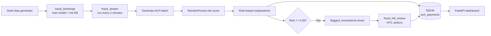

# ACH Fraud Detection

ACH payment fraud detector is an Airflow-powered application that combines machine learning, interpretable risk reasons, and human review in one workflow.

The project simulates live ACH payments, scores them with a trained RandomForest model, stores the results in SQLite, and presents suspicious transactions to a reviewer through a custom dashboard.

## Why this matters

Fraud detection is not only a classification problem. A useful system must also:

- process payments continuously;
- surface understandable reasons for a risk decision;
- preserve an audit trail;
- route high-risk cases to a person;
- make the current state easy to inspect.

This demo focuses on that complete loop instead of showing an isolated model prediction.

## What the project does

1. Generates a reproducible labeled ACH dataset for model training.
2. Runs `fraud_bootstrap` once to initialize storage and train a RandomForest classifier.
3. Runs `fraud_stream` every two minutes to generate a batch of 15 unlabeled payments.
4. Converts payment attributes into model features and produces a fraud risk score.
5. Applies transparent rules to add human-readable explanations such as unusually large amounts, new receivers, unusual hours, cross-state payments, and young accounts.
6. Marks payments at or above the `0.55` risk threshold as suspicious and stores all payments in SQLite.
7. Emits a `flagged_transactions` Airflow Asset when a batch contains suspicious payments.
8. Starts `fraud_hitl_review`, which creates one human review action per unresolved flagged payment.
9. Displays recent payments, risk scores, explanations, KPIs, and decisions in the ACH Fraud Dashboard.

## How it works



### Airflow orchestration

- `fraud_bootstrap` uses an `@once` schedule. It creates the database schema and saves the model to `include/models/ach_fraud_model.joblib`.
- `fraud_stream` runs every two minutes and waits for the bootstrap DAG's `train_model` task before scoring payments. Its score task also checks that the model file exists.
- `fraud_hitl_review` is scheduled by the `flagged_transactions` Asset. It fetches unresolved suspicious payments and dynamically maps review tasks over them.

### Detection approach

The model is trained from synthetic labeled data. Features include amount, log amount, timestamp-derived fields, account age, ACH SEC code, payment type, channel, and whether the originator and receiver are in different states.

The model provides a probability-like risk score. The rule engine adds context that a reviewer can understand. A payment is stored as suspicious when its score is at least `0.55` or the rule engine finds a reason to flag it.

Live payments intentionally do not include their synthetic ground-truth fraud label. That keeps the streaming path closer to the real problem: the system must make a decision using available transaction data, then let a human reviewer provide the final outcome.

## Dashboard

The plugin mounts the dashboard at:

```text
/fraud-dashboard/
```

It provides:

- total payment and review KPIs;
- recent ACH payments with risk and decision status;
- a sortable flagged-payment table;
- transaction details and stored explanations;
- Legitimate, Fraud, and Needs Investigation actions;
- reviewer notes persisted alongside the decision.

Payments below the review threshold are shown as **Not flagged**, because they are not eligible for a human fraud decision in this workflow.

## Run locally

Prerequisites:

- Docker
- Astro CLI

From this directory:

```bash
cd ach-fraud-detect
astro dev start
python3 scripts/generate_seed_data.py
```

Open the Airflow UI at the URL printed by Astro, then:

1. Confirm `fraud_bootstrap` completes and creates the model.
2. Watch `fraud_stream` run on its two-minute schedule.
3. Open **ACH Fraud Dashboard** from the Airflow navigation.
4. Select a flagged payment and submit a decision, or use **Browse -> Required Actions**.

To stop and remove the local Airflow environment, including its metadata database and Docker volumes:

```bash
astro dev kill
```

The command removes runtime data, but it does not restore or delete files in the project directory.

## Project layout

| Path                               | Purpose                                                             |
| ---------------------------------- | ------------------------------------------------------------------- |
| `dags/fraud_bootstrap.py`          | One-time database initialization and model training                 |
| `dags/fraud_stream.py`             | Recurring payment generation, scoring, explanation, and persistence |
| `dags/fraud_hitl_review.py`        | Asset-triggered human review workflow                               |
| `include/fraud_utils/generator.py` | Synthetic training and live payment generation                      |
| `include/fraud_utils/features.py`  | Feature engineering shared by training and scoring                  |
| `include/fraud_utils/reasons.py`   | Explainable rule-based fraud reasons                                |
| `include/fraud_utils/db.py`        | SQLite schema, queries, and human decision persistence              |
| `plugins/fraud_dashboard.py`       | FastAPI plugin registration and API endpoints                       |
| `plugins/fraud_dashboard.html`     | Dashboard user interface                                            |
| `tests/dags/`                      | DAG import, tags, retry, and dashboard checks                       |

## What was hard

### Making the demo feel like a real streaming system

Training data has labels, but live payments do not. The generator therefore uses one path for reproducible labeled training examples and another path for unlabeled live batches. Keeping their schemas and feature transformations compatible while removing the live fraud label was important for a credible simulation.

### Combining model output with explanations

A model score alone does not tell a reviewer why a payment is risky. The rule engine examines the transaction and recent originator history to produce concrete reasons. It also has to tolerate an empty history and avoid treating every low-risk payment as a review case.

### Coordinating a one-time bootstrap with a recurring DAG

The stream must not race the model-training DAG. Bootstrap runs once, while the stream runs repeatedly, so the stream includes an explicit cross-DAG wait for the successful `train_model` task plus a model-file check at scoring time. This protects both the normal startup path and the case where runtime state has been recreated.

### Closing the human-in-the-loop loop

The review workflow dynamically creates actions only for unresolved flagged payments. Decisions can arrive from Airflow's Required Actions UI or the custom dashboard, so both paths share the same SQLite update function and remain visible in the same dashboard.

### Keeping the demo inspectable

SQLite keeps the project self-contained and easy to reset, query, and explain during a hackathon demo. It is deliberately a lightweight demo store rather than a production banking database; a production deployment would use a durable managed database, stronger identity and access controls, and additional operational safeguards.

## Validation

The DAG integrity suite runs inside the Astro Runtime image:

```bash
astro dev pytest tests/dags/test_dag_integrity.py --args "-q"
```

The suite verifies DAG imports, tags, retry configuration, and the dashboard API prefix.

## Limitations and next steps

This is a hackathon demo using synthetic data and a local SQLite database. A production version would need calibrated model probabilities, feature and model versioning, drift monitoring, a managed transactional store, authentication and authorization, encrypted data handling, stronger audit controls, and a broader test set with domain-reviewed fraud labels.
