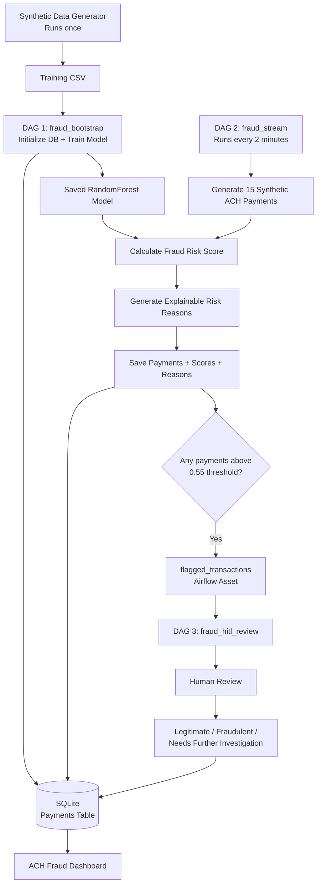

# ACH Fraud Detector

ACH Fraud Detector is an Airflow-powered ACH payment fraud detection system that combines machine learning, explainable risk scoring, and human-in-the-loop (HITL) review into one end-to-end workflow.

Financial institutions process millions of payments every day, making it difficult for fraud teams to manually investigate every transaction. An effective fraud detection system can help teams focus on the payments most likely to be suspicious while still providing context for each decision. This project demonstrates how Airflow can orchestrate that process from automated detection and explanation to human review and final decision.

## What does this project do?

This project simulates how a financial institution could use Airflow to automate transaction monitoring and review. Every two minutes, the application generates a batch of 15 synthetic ACH payments, scores them for fraud risk with a trained RandomForest model, flags high-risk payments that crosses the 0.55 threshold, explains why they were flagged, and routes them to a human reviewer through a custom dashboard.

Through the web dashboard, reviewers can then classify flagged transactions as:

- **Legitimate**
- **Fraudulent**
- **Needs Further Investigation**

The final decision is saved to the database and reflected on the dashboard.

# How it works

The application is organized into **three Airflow DAGs**, plus a one-time data generation script.



## 1. Initial synthetic data generation

Before Airflow starts processing live payments, a script generates an initial labeled dataset.

> **Hackathon note:** All payment data in this project is **synthetically generated**. The transaction structure and attributes are modeled after real ACH payment concepts and fields defined by **Nacha (National Automated Clearing House Association)**. No real banking or customer data is used.

```bash
python3 scripts/generate_seed_data.py
```

This produces a CSV file containing synthetic ACH payment data that is used to train the initial fraud detection model.

The generated transactions include attributes inspired by real ACH payment characteristics, such as:

- transaction amount;
- timestamp;
- account age;
- ACH SEC code;
- payment type;
- transaction channel;
- originator and receiver state;
- other transaction-level attributes.

The training data contains a synthetic fraud label so the machine learning model can learn patterns associated with fraudulent payments.

## 2. DAG 1 — `fraud_bootstrap`

The bootstrap DAG handles the **one-time initialization** of the application.

### Task 1: Initialize the database

Creates the SQLite database and the tables required to store processed transactions and human review decisions.

### Task 2: Train the fraud model

The training CSV is transformed into model features and used to train a **RandomForest classifier**.

The trained model is saved as:

```text
include/models/ach_fraud_model.joblib
```

At the end of the bootstrap phase, the application has:

- a database ready to store transactions;
- a trained machine learning model ready to score new payments.

## 3. DAG 2 — `fraud_stream`

This is the application's **continuous transaction-processing pipeline**.

It runs every **2 minutes**.

### Step 1: Generate payments

A new batch of **15 synthetic ACH payments** is generated.

Unlike the training data, these live transactions **do not contain a fraud label**.

This simulates the real-world problem where the system receives a transaction and must decide whether it appears suspicious based only on the information available at the time.

### Step 2: Score transactions

The DAG loads the saved RandomForest model and converts each payment into the same feature representation used during training.

The model produces a fraud risk score.

For example:

```text
Transaction A → 0.18 fraud risk
Transaction B → 0.80 fraud risk
Transaction C → 0.63 fraud risk
```

A score of `0.80` means the model considers that transaction substantially more suspicious than one with a score of `0.18`.

### Step 3: Flag and explain

Payments with a risk score of **0.55 or higher** are flagged for human review.

For flagged transactions, the application also generates understandable risk reasons, such as:

```text
• Unusually large transaction amount
• New receiver
• Transaction occurred during an unusual hour
• Originator and receiver are in different states
• Originator account is relatively young
```

This gives reviewers context instead of showing them only a model score.

### Step 4: Save results

The entire batch is stored in SQLite, including:

- transaction details;
- fraud risk score;
- flagged status;
- generated risk reasons;
- review status;
- reviewer decision and notes when applicable.

### Step 5: Trigger human review

If a batch contains flagged transactions, the DAG emits an Airflow **Asset** called:

```text
flagged_transactions
```

That asset triggers the human-review DAG.

## 4. DAG 3 — `fraud_hitl_review`

The third DAG handles the **human-in-the-loop review process**.

### Step 1: Find transactions that need review

The DAG queries the database for unresolved flagged transactions and prioritizes the highest-risk cases.

Up to **10 transactions** can be prepared for review at a time.

### Step 2: Create review actions

Each flagged transaction is converted into a reviewable payload containing the information a reviewer needs to make a decision.

Airflow dynamically creates a HITL review action for each transaction.

### Step 3: Human decision

The reviewer can choose:

```text
Legitimate
Fraudulent
Needs Further Investigation
```

The decision and reviewer notes are persisted back to the SQLite database.

The workflow can also automatically resolve an unanswered review as **Needs Further Investigation after 24 hours**.

# Dashboard

The custom ACH Fraud Dashboard continuously polls the database and refreshes with the latest transaction information.

Open it from the Airflow navigation at:

```text
/fraud-dashboard/
```

The dashboard shows:

- total payment and review KPIs;
- recent ACH transactions;
- fraud risk scores;
- flagged transactions;
- explainable fraud reasons;
- current review status;
- reviewer decisions and notes.

Reviewers can select a flagged transaction and submit their decision directly from the dashboard.

The same decisions are also visible through Airflow's **Required Actions** interface.

This creates a closed loop:

```text
Transaction
    ↓
ML Risk Score
    ↓
Flagged
    ↓
Human Review
    ↓
Decision
    ↓
Database
    ↓
Dashboard
```

# What was hard?

## 1. Making a batch pipeline behave like a streaming system

The project needed to simulate continuously arriving payments without relying on real ACH data.

The solution was to separate the workflow into:

- a reproducible, labeled dataset for model training;
- continuously generated, unlabeled payment batches for scoring.

The live transaction path therefore has to make a fraud decision without knowing the synthetic ground-truth label, which better represents the real fraud-detection problem.

## 2. Connecting machine learning with explainable decisions

A fraud score by itself is not very useful to a reviewer.

The project therefore combines the RandomForest score with a rule-based explanation layer that looks for transaction characteristics and recent originator history.

This creates a more practical review experience:

```text
Fraud Risk: 82%

Why was it flagged?
• Large transaction amount
• New receiver
• Unusual transaction hour
• Cross-state payment
```

The challenge was making the explanation layer useful without turning every unusual transaction into a fraud alert.

## 3. Coordinating three Airflow workflows

The three DAGs have different execution patterns:

```text
fraud_bootstrap
      ↓
fraud_stream
      ↓
flagged_transactions Asset
      ↓
fraud_hitl_review
```

The bootstrap DAG runs once, while the streaming DAG runs every two minutes.

The streaming DAG therefore needs to make sure the model has already been trained before attempting to score payments.

The implementation uses both:

- an explicit cross-DAG dependency on the bootstrap training task;
- a model-file existence check before scoring.

This prevents the streaming workflow from racing ahead during initialization or after the local environment has been recreated.

## 4. Closing the human-in-the-loop loop

The project was not just about generating a fraud prediction. The difficult part was connecting that prediction to an actual review workflow.

Flagged transactions must be:

1. identified;
2. prioritized;
3. converted into review actions;
4. presented to a human;
5. resolved with a decision;
6. persisted back into the database;
7. reflected in the dashboard.

The dashboard and Airflow Required Actions interface both update the same underlying transaction record so the workflow stays consistent.

# Run locally

## Prerequisites

- Docker
- Astro CLI

Clone the repository and run:

```bash
cd ach-fraud-detect
astro dev start
```

Generate the initial training data:

```bash
python3 scripts/generate_seed_data.py
```

Open the Airflow UI at the URL printed by Astro.

### Recommended demo flow

**1. Run `fraud_bootstrap`**

Confirm that the database is initialized and the machine learning model is created.

**2. Let `fraud_stream` run**

Every two minutes, a new batch of 15 synthetic ACH payments is generated and scored.

**3. Open the ACH Fraud Dashboard**

Watch new transactions appear and look for flagged payments.

**4. Review a flagged transaction**

Select a suspicious transaction and submit:

```text
Legitimate
Fraudulent
Needs Further Investigation
```

You can also complete the review through:

```text
Browse → Required Actions
```

**5. Watch the dashboard update**

The review decision is written back to the database and reflected in the dashboard.

## Stop the local environment

```bash
astro dev kill
```

This removes the local Airflow runtime, metadata database, and Docker volumes.

It does **not** delete files in the project directory.

# Project structure

| Path                               | Purpose                                                             |
| ---------------------------------- | ------------------------------------------------------------------- |
| `dags/fraud_bootstrap.py`          | One-time database initialization and model training                 |
| `dags/fraud_stream.py`             | Recurring payment generation, scoring, explanation, and persistence |
| `dags/fraud_hitl_review.py`        | Asset-triggered human review workflow                               |
| `include/fraud_utils/generator.py` | Synthetic training and live payment generation                      |
| `include/fraud_utils/features.py`  | Shared feature engineering                                          |
| `include/fraud_utils/reasons.py`   | Explainable fraud-risk reasons                                      |
| `include/fraud_utils/db.py`        | Database schema, queries, and review persistence                    |
| `plugins/fraud_dashboard.py`       | FastAPI dashboard registration and API endpoints                    |
| `plugins/fraud_dashboard.html`     | Dashboard UI                                                        |
| `tests/dags/`                      | DAG and dashboard validation tests                                  |

# Validation

The DAG integrity tests can be run inside the Astro Runtime:

```bash
astro dev pytest tests/dags/test_dag_integrity.py --args "-q"
```

The test suite validates items such as:

- DAG imports;
- DAG tags;
- retry configuration;
- dashboard API configuration.

# Future improvements

The current model is trained once during the bootstrap phase and then used to score incoming transactions. A key next step would be to create a **continuous model retraining loop**.

As transactions are reviewed by humans, their decisions could become new labeled training data. Periodically retraining the model on this newly reviewed data would allow it to learn from emerging fraud patterns and reduce reliance on a static model.
